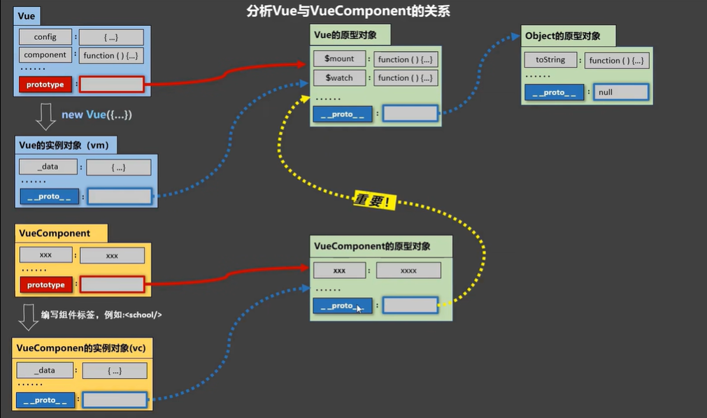

## 组件和模块
### 什么是组件？什么是模块?
&nbsp;&nbsp;&nbsp;&nbsp;&nbsp;&nbsp;&nbsp;如果将人理解成一个整体，模块就是保证人这个整体存活下去的系统，每个系统/模块完成某些功能。在代码层面，我们可以理解为完成某一些功能的.js文件。  
&nbsp;&nbsp;&nbsp;&nbsp;&nbsp;&nbsp;&nbsp;同样将人理解为一个整体，组件就相当于我们的某个或一些细胞，单独能完成一定功能的同时，也能和其他细胞配合。在vue中，项目的就是一个集合体，每一个组件都是其组成部分。当然和人与细胞不太一样的是，在vue中，组件的组成部分仍然可以是组件，也就是可以嵌套。组件表现在代码上就是某一个或几个功能的集合的.vue文件，因为其是独立的一部分，所以在任何需要它的地方都可以使用。  
  
&nbsp;&nbsp;&nbsp;&nbsp;&nbsp;&nbsp;&nbsp;该图中每一个颜色不衔接的区域都可以视为一个组件。 <br/>  
### 我们为什么要使用组件这种结构?
&nbsp;&nbsp;&nbsp;&nbsp;&nbsp;&nbsp;&nbsp;请大家回想回想一下，当初我们初学html时，我们介绍过js的引入、css的引入，最终汇集在html上进行使用，假设我们需要其中的某一项功能，需要将其应用于另一html文件中，那我们会怎么做？重写一份？不不不，相信大家都不愿意在写一份一模一样的代码，我们一般会在原html中找到该功能模块的代码，然后找到支持其功能的js和支持其样式的css，而不幸的是，这些css和js往往可能在不同的文件中，这样很费时费力。  
&nbsp;&nbsp;&nbsp;&nbsp;&nbsp;&nbsp;&nbsp;针对这种情况，vue、react等使用了组件化的概念，将某一功能的html、js、css代码汇集在一起，以这样的方式方便寻找和复用，只要你还记得设计组件时给它起的名字。  

## 创建一个组件
&nbsp;&nbsp;&nbsp;&nbsp;&nbsp;&nbsp;&nbsp;我们先了解两个概念，非单文件组件和单文件组件。在我们的项目编写中使用的是单文件组件，因为工作中的项目几乎不可能独立完成，因此你写的组件完全有可能被他人使用，为了促进伙伴间的关系，还请书写单文件组件。
> 1. 非单文件组件：一个文件中有n个组件
> 2. 单文件组件：一个文件仅中有1个组件
```vue
  <template>     
  <!-- 创建一个组件，写法和正常的vue文件书写方式一致 -->
  <!-- 因为大家看这些教程，基本都奔着项目开发去的，因此在这里我就直接展示在项目中的写法-->
  <!-- 至于在html中使用的代码，如有需要，联系博主添加 -->
    <div>
      <h2>{{ shwoInfo }}</h2>
    </div>
  </template>

  <script>
  export default {
    name: "BreadCrumb",
    data() {
      return {
        shwoInfo: "我是一个组件", 
      }
    },
  };
  </script>
```
```vue
  <template>
    <div>
      <h2>{{ shwoInfo }}</h2>
      <IndependentQuery/>    <!--  使用声明的组件  -->
      <!-- <IndependentQuery> </IndependentQuery/> 或者这种也可 -->
    </div>
  </template>

  <script>
  import IndependentQuery from './independentQuery'
  export default {
    name: 'filghtInfo',
    components:{IndependentQuery},   // 声明一个组件
    data() {
      return {
        shwoInfo: "我是使用组件的地方",
      };
    }
  };
</script>
```
&nbsp;&nbsp;&nbsp;&nbsp;&nbsp;&nbsp;&nbsp;组件命名的规范，在vue项目中，对于组件的命名也有一定的要求，当然如果你不按这种规范书写也可能没有问题，但为了安全还是推荐遵守规范！   
> 1. 单个单词： school / School   
> 2. 多个单词： IndependentQuery / 'independent-query'  
> 3. 尽可能避免与已有的html标签重名  

## 初学Vuecomponents和this
&nbsp;&nbsp;&nbsp;&nbsp;&nbsp;&nbsp;&nbsp;从名字上我们大致知道Vuecomponents是vue的组件对象，它是不需要程序员自己调用的。具体到vue项目中且以上文的IndependentQuery组件为例，当我们使用已经声明的组件\<IndependentQuery/>时，vue会自动帮我们new一个IndependentQuery的实例对象，即执行new Vuecomponents(options)，<span style="color:red">我们每次调用自定义组件时，vue都会给我们一个新的组件实例对象。</span>    
&nbsp;&nbsp;&nbsp;&nbsp;&nbsp;&nbsp;&nbsp;在vue中this是一个使用非常频繁的单词，它往往是一个指代关系，指代对象是vm（View Model），在前面我们提到过[MVVM模型](../basis/template.md)，即我们在js中的所有代码都可以通过this读取到自身.vue文件的所有数据和方法。  
&nbsp;&nbsp;&nbsp;&nbsp;&nbsp;&nbsp;&nbsp;因为我们每次使用组件时，Vuecomponents都会给我们一个新的实例对象，所以他们的this指向它们各自的vm（因为他们都是Vuecomponents创建出来的，这里也可称为vc），正是因为他们的this指向不同，会产生组件间的通信问题，这个后面会讲，这里知道这个问题就行。  
> 关于this指向:
> 1. 组件配置中:  
data函数、methods中的函数、watch中的函数、computed中的函数它们的this均是【VueComponent实例对象/vc】  
> 2. new Vue(options)配置中:  
data函数、methods中的函数、watch中的函数、computed中的函数它们的this均是【Vue实例对象/vm】。  

  

&nbsp;&nbsp;&nbsp;&nbsp;&nbsp;&nbsp;&nbsp;在图中我们可以看到，vc的隐式原型对象指向了vm的原型对象（`VueComponent.prototype.__proto__ === Vue.prototype`），这就导致vm和vc的功能基本一致，所以我们编写的.vue文件才会是相同的样式，也因为这条指向关系的存在，后期我们介绍组件间通信的时候也可以用到。  

