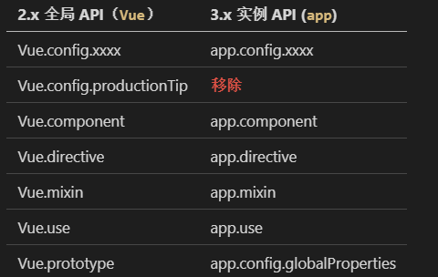

&nbsp;&nbsp;&nbsp;&nbsp;&nbsp;&nbsp;&nbsp;这里介绍的是一些非常用的组合式Api，大家稍作了解。   

### shallowReactive 与 shallowRef

#### shallowReactive
```
  let test = shallowReactive({
    name:'123',
    left:{
      city:{
        job:{
          wages:18,
        }
      }
    }
  })
```
&nbsp;&nbsp;&nbsp;&nbsp;&nbsp;&nbsp;&nbsp;在reactive初始化对象时，会对每一层的数据都添加上响应式，而shallowReactive只处理对象最外层属性的响应式（浅响应式）。假如嵌套多层，不去关注对象其它层部的变化，类似于v2中未开启深度监视的对象。  
&nbsp;&nbsp;&nbsp;&nbsp;&nbsp;&nbsp;&nbsp;应用场景：数据嵌套比较深，但只有最浅层需要更改。  

#### shallowRef
```
let test = shallowRef({
  name:'123'
})
```
&nbsp;&nbsp;&nbsp;&nbsp;&nbsp;&nbsp;&nbsp;当时用ref初始对象式数据，ref函数会自动帮我们调用reactive函数实现响应式，而shallowRef只处理基本数据类型的响应式, 不进行对象的响应式处理。  
&nbsp;&nbsp;&nbsp;&nbsp;&nbsp;&nbsp;&nbsp;应用场景：数据定义后不会再更改。  


### readonly 与 shallowReadonly

#### readonly
```
  let test = reactive({
    name:'123',
    left:{
      city:{
        wages:18,
      }
    }
  })
  test = readonly(test)
```
&nbsp;&nbsp;&nbsp;&nbsp;&nbsp;&nbsp;&nbsp;将当前传入的参数加工为只读的属性，任何的修改都不会执行。  
&nbsp;&nbsp;&nbsp;&nbsp;&nbsp;&nbsp;&nbsp;应用场景：没啥用，个人感觉。  

#### shallowReadonly
```
  let test = reactive({
    name:'123',
    left:{
      city:{
        wages:18,
      }
    }
  })
  test = readonly(test)
```
&nbsp;&nbsp;&nbsp;&nbsp;&nbsp;&nbsp;&nbsp;将当前传入的参数加工为只读的属性，但只是浅层次的，例如修改wages的值就会被允许。  
&nbsp;&nbsp;&nbsp;&nbsp;&nbsp;&nbsp;&nbsp;应用场景：没啥用，个人感觉。  

### toRaw 与 markRaw

#### toRaw
```
  let test = reactive({
    name:'123',
    left:{
      city:{
        wages:18,
      }
    }
  })
  test = toRaw(test)
```
&nbsp;&nbsp;&nbsp;&nbsp;&nbsp;&nbsp;&nbsp;将一个由```reactive```生成的<strong style="color:orange">响应式对象</strong>转为<strong style="color:orange">普通对象</strong>  
&nbsp;&nbsp;&nbsp;&nbsp;&nbsp;&nbsp;&nbsp;应用场景：将响应式的内容转化为普通内容，希望该内容的修改不会引起页面的变化。  

#### markRaw
```
  let test = reactive({
    name:'123',
    left:{
      city:{
        wages:18,
      }
    }
  })
  let job = {name:"student"}
  test.job = markRaw(job)
```
&nbsp;&nbsp;&nbsp;&nbsp;&nbsp;&nbsp;&nbsp;标记一个对象，使其永远不会再成为响应式对象。  
&nbsp;&nbsp;&nbsp;&nbsp;&nbsp;&nbsp;&nbsp;应用场景：有些值不应被设置为响应式的，例如复杂的第三方类库等。当渲染具有不可变数据源的大列表时，跳过响应式转换可以提高性能。

### customRef

```
  function myRef(value,delay){
    return customRef((track,trigger)=>{
      return{
        get(){
          track() //告诉Vue这个value值是需要被“追踪”的
          return value 
        },
        set(newValue){
          value = newValue
          trigger() //告诉Vue去更新界面
        }
      }
    }
  )}
```
&nbsp;&nbsp;&nbsp;&nbsp;&nbsp;&nbsp;&nbsp;创建一个自定义的ref，并对其依赖项跟踪和更新触发进行显式控制。  
&nbsp;&nbsp;&nbsp;&nbsp;&nbsp;&nbsp;&nbsp;应用场景：将响应式的内容转化为普通内容，希望该内容的修改不会引起页面的变化。  

### provide和inject
&nbsp;&nbsp;&nbsp;&nbsp;&nbsp;&nbsp;&nbsp;父组件与孙组件及后代传值。父组件有一个 provide 选项来提供数据，后代组件需要有一个 inject 选项来开始使用这些数据。  
```
父组件:
  setup(){
    let car = ref('路虎');
    provide('car',car);
  }

孙组件或后代
  const car = inject('car')
```

### 响应对象的判断

+ isRef: 检查一个值是否为一个 ref 对象
+ isReactive: 检查一个对象是否是由 reactive 创建的响应式代理
+ isReadonly: 检查一个对象是否是由 readonly 创建的只读代理
+ isProxy: 检查一个对象是否是由 reactive 或者 readonly 方法创建的代理


### vue3新组件

#### fragment
&nbsp;&nbsp;&nbsp;&nbsp;&nbsp;&nbsp;&nbsp;组件可以没有根标签`template`, 内部会自动将多个标签包含在一个Fragment虚拟元素中。 

#### teleport
&nbsp;&nbsp;&nbsp;&nbsp;&nbsp;&nbsp;&nbsp;将元素转移到指定位置的技术，用于封装自己的组件库，类似于elementui帮我们做好的一下效果（弹窗、提示等）。
```
  <teleport to="html">  // to的值可以直接为html元素以及选择器
    //将要传送的内容
  </teleport>
```

#### Suspense（试验阶段）
&nbsp;&nbsp;&nbsp;&nbsp;&nbsp;&nbsp;&nbsp;等待异步组件时渲染一些额外内容，让应用有更好的用户体验。  
```
// 异步组件引入资源，动态引入。
  import {defineAsyncComponent} from 'vue'  
  const Child = defineAsyncComponent(()=>import('./components/Child.vue'))      

// html
  <Suspense> 
    <template v-slot:default> 
      <Child/> 
    </template> 
    <template v-slot:fallback> 
      <h3>加载中.....</h3> 
    </template> 
  </Suspense>
```
&nbsp;&nbsp;&nbsp;&nbsp;&nbsp;&nbsp;&nbsp;网络限制或慢速时，可以对将要显示的内容进行异步加载，使其不影响正常的组件显示，其位置由fallback插槽占位，在组件被加载完毕后，再显示原本的组件内容。 
&nbsp;&nbsp;&nbsp;&nbsp;&nbsp;&nbsp;&nbsp;前文我们提到过setup的返回值return不能是一个promise对象，但当我们使用异步组件`Suspense`并动态引入组件资源时，我们可以使用promise对返回的值进行包裹。

### others

+ 全局Api的转变

+ [过渡类名的转变](../assembly/animation.md)：v-enter/v-leave =====> v-enter-from/  v-leave-from
+ 移除keyCode作为 v-on 的修饰符，同时也不再支持config.keyCodes   （[键盘按键事件的绑定](./vueEvent.md)）
+ 移除v-on.native修饰符
+ 移除过滤器filter
+ ...


