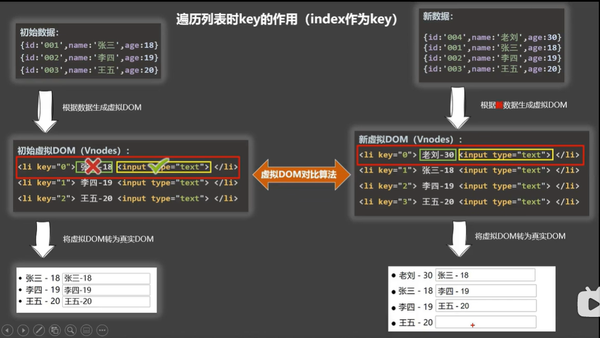

## 渲染
&nbsp;&nbsp;&nbsp;&nbsp;&nbsp;&nbsp;&nbsp;大家第一次知道渲染这个词，可能是在布料渲染领域，在前端开发人员眼中，其代表着[html页面渲染](https://wenku.baidu.com/view/7cc068f72bea81c758f5f61fb7360b4c2e3f2a36.html)，即将我们编写的html代码展示在页面的过程。  
&nbsp;&nbsp;&nbsp;&nbsp;&nbsp;&nbsp;&nbsp;当我们更改了css中配置、数据值的变更等都会导致页面的内容被重新解析展示，在这个过程中涉及到两个概念：[重绘和重排](https://wenku.baidu.com/view/8bd1e3986adc5022aaea998fcc22bcd126ff4202.html)。  
> 1. 重绘：重绘是一个元素外观的改变所触发的浏览器行为，例如改变vidibility、outline、背景色等属性。浏览器会根据元素的新属性重新绘制，使元素呈现新的外观。重绘不会带来重新布局，并不一定伴随重排。    
> 2. 重排：重排是更明显的一种改变，可以理解为渲染树需要重新计算。例如获取某些属性clientLeft、clientWidth、clientHeight等时，浏览器需要获取到准确的值就会触发重排；再者，改变元素的一些样式，调整浏览器窗口大小等也会触发重排。  
> 3. <span style="color:red">浏览器在进行重绘和重排的时候是要付出高昂的性能代价的。因此在前端代码编写中减少重排和重绘也是对编译人员技术的考察</span>  

### 条件渲染
```vue
  <h2 v-show="1 == 1 / true">你好</h2>
  <h2 v-if="1 == 1 / true">你好</h2>
```
&nbsp;&nbsp;&nbsp;&nbsp;&nbsp;&nbsp;&nbsp;一般来说，我们编译的html代码都会被被解析展示到页面上，当需要对某些元素二者选其一展示时亦或者其他类似的情况，就会使用到条件渲染。上文展示的就是条件渲染的两种常见写法。
> 1. v-show指令作用于元素上控制元素是否展示，实则是是在元素的css属性动态添加`display:none`实现的。  
> 2. v-if指令则做的更彻底一点，假设你看过[html页面渲染过程](https://wenku.baidu.com/view/7cc068f72bea81c758f5f61fb7360b4c2e3f2a36.html)，你就会知道html解析模版时会生成dom树，dom树上的每个节点都代表这我们编写的html标签或其他，v-if就是通过控制dom节点的存在与否来控制元素的显隐;即当v-if为false时，在dom树上甚至都没有这标签代表的节点。  
> 3. v-if还可以搭配v-else-if或v-else使用，类似于我们在学习js时使用的条件判断的if — else if — else和if — else，当然v-else-if也可以多次使用。   
> 4. 因为v-if的渲染开销更大，所以我们要按需使用。如果需要非常频繁地切换，则使用v-show较好;如果在运行时条件很少改变，则使用v-if较好。
> 5. 当有很多html内容需要同一个条件动态显示和影藏时，就需要有一个结构将这些内容都包裹起来，这时div标签就可以实现，但是这样就会破坏原有的dom结构，因此这种情况下我们使用的是template,<span style="color:red">要注意的是template只能和v-if配合使用，</span>`<template v-if="true"></template>`。  

### 列表渲染
```html
<!-- html:列表渲染 -->
  <ul>
    <li v-for="(item,index) in person" :key="item.id">
      
    </li>
  </ul>
```
```js
// js->data->return:
  {
    person:[
      {id:0,name:'001',age:'18'}
      {id:1,name:'002',age:'28'}
      {id:2,name:'003',age:'8'}
    ],
  }
```
&nbsp;&nbsp;&nbsp;&nbsp;&nbsp;&nbsp;&nbsp;列表渲染简单来说就是将表格类型的数据展示出来，面对数量庞大的表格数据，我们不可能将所有\<li>直接写出，这是就需要用到v-for指令，类似于js的for循环。  
&nbsp;&nbsp;&nbsp;&nbsp;&nbsp;&nbsp;&nbsp;vue中的v-for指令不仅仅能遍历数组类型的数据，还能遍历的对象形式的数据，自然字符串类型的数据也是可以使用v-for指令遍历的。在遍历对象数据时，item和index就不是代表数组每一项和下标，而是代表着对象的每一项的value值和key值.在遍历字符串数据时，item和index代表字符串的每个字符和下标。 

#### key值的作用

&nbsp;&nbsp;&nbsp;&nbsp;&nbsp;&nbsp;&nbsp;如果你觉得博主这里没讲清楚，请观看天禹老师的[vue全家桶课程](https://www.bilibili.com/video/BV1Zy4y1K7SH?p=30)，讲课幽默风趣，即使不想听课，也可以当做相声用于休闲。  
&nbsp;&nbsp;&nbsp;&nbsp;&nbsp;&nbsp;&nbsp;细心的大家可能发现了，在v-for遍历数据时，我们同时还动态为每一项绑定了key值，那么为什么要这么做呢？  
&nbsp;&nbsp;&nbsp;&nbsp;&nbsp;&nbsp;&nbsp;在我们学习最初学习html文件时，是怎么更改标签的内容和状态的!我们通常使用`document.getElementById`或其他方法获取到该标签,再去更改标签的相关信息，然后浏览器监测到我们更改了某些信息，浏览器会拿着我们更改后的文章重新解析生成dom...再帮我们绘制页面。  
&nbsp;&nbsp;&nbsp;&nbsp;&nbsp;&nbsp;&nbsp;大家难道不会觉得这个过程太傻了么，我只是更改了一部分内容，浏览器何必去重新解析所有的内容呢！这就是问题的关键了，因为浏览器根本不知道我们改了哪些地方，浏览器只能当做我们所有地方都有变动，那只好重新解析所有内容。  
&nbsp;&nbsp;&nbsp;&nbsp;&nbsp;&nbsp;&nbsp;在vue、react等前端框架中都解决这一问题，要不然为啥会推出这些新的语言呢！在vue、react等中加入了虚拟dom的环节，页面解析渲染前，先交由虚拟dom检查，汇集更改的部分重新解析交给真实dom，至于没有更改的内容那自然是原封不动的交出去喽，真实dom就拿着解析好的内容重新渲染页面。  
&nbsp;&nbsp;&nbsp;&nbsp;&nbsp;&nbsp;&nbsp;虚拟dom检查的过程自然不会是一一对比我们的编写的内容，因为那样耗时长且无意义，虚拟dom检查所参照的就是key值[<span style="color:red">终于讲到key了</span>]。新旧相同的key值就会去比较内容，新的虚拟dom中新出现的key就是需要重新解析的，大致如下图（也是天禹老师讲课的展示图）。

> index下标作为key值  
&nbsp;&nbsp;&nbsp;&nbsp;&nbsp;&nbsp;&nbsp;从图中我们可以看到，使用index下标作为key值时，此时在数组头部添加数据时，左右的对比过程，首先文字不同，需要更换，于是被更换了；而后者input框内的内容没有改变所以原样继承。这样就导致了内容的不一致。
  
&nbsp;&nbsp;&nbsp;&nbsp;&nbsp;&nbsp;&nbsp;事实上，使用index作为key值时，所有破坏数组顺序的操作，如unshift、reverse，都会造成内容不匹配的问题，<span style="color:red">因此，一般要求选择不会重复的属性作为key值</span>


