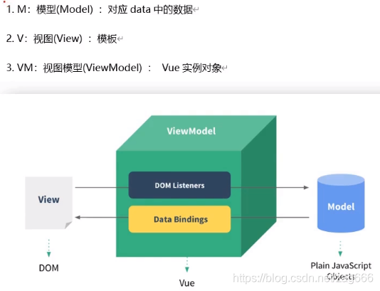

## 使用须知

&nbsp;&nbsp;&nbsp;&nbsp;&nbsp;&nbsp;&nbsp;相信在这里大家,大家已经下载好了vue的相关工具，下面让我们开始学习vue文件的基本格式吧！（其实和我们学过的html、css、js文件并无不同，只是将他们糅合在一起）

### vue模版
```
<template>
  <div>
    {{ Welcome }}  // 这个就是插值语法，{{}}
  </div>
</template>

<script>
export default {
  data() {
    return {
      Welcome:"我来学习了"
    }
  },
  created() {},
  mounted() {},
  methods: {},
}
</script>
<style scoped >

</style>
```
&nbsp;&nbsp;&nbsp;&nbsp;&nbsp;&nbsp;&nbsp;上面的代码段，大家如果写过vue文件（可跳过此段内容），应该会比较熟悉了，没写过也没关系，我会给你讲解文件大致内容。
> <template\> 标签内包含的是我们学过的html代码，我们书写的标签、静态文字等都放在这里。

> \<script> 标签中包含的是我们定义的属性（变量）、事件、外部文件引入等，通常我们将属性编写在date中，以return返回，将事件方法写在下面的created、mounted、methods等内部，当然为了代码的可维护以及代码功能的完善，我们通常会把不同功能的代码放在不同的对象或函数内，这些书写以后再说。

> <style\>标签的内部书写的是css、less、sass等代码，负责的是html内容的样式。

### 插值语法
```
<template>
  <div>
    {{ Welcome }}  // 这个就是插值语法，{{}}
  </div>
</template>
```
1. 在插值表达式中，只能设置简单的javascript表达式，不能设置复杂的表达式(例如for循环)。  
2. 在data值大小不改变的前提下，可以进行一般的 算术运算、比较运算、逻辑运算、三元操作符等运算使用，也可以通过常量进行数据体现。
3. 插值表达式只能用在html标签的内容区域，不能用在其他地方。
4. <span v-pre>{{}}</span>花括号与变量之间为了美观，通常表达式左右各一个空格。  
5. 如果实在拿不准能不能写在插值语法中，请不要写

## MVVM模型
&nbsp;&nbsp;&nbsp;&nbsp;&nbsp;&nbsp;&nbsp;vue其实并没有严格参照[MVVM模型](https://blog.csdn.net/zag666/article/details/116212169)，但是vue的设计也受到了其启发，所以我们有必要了解下其的工作机制，从下图中我们可以了解到，Vue实例对象好像在帮我们把data中定义的数据交给视图（html），然后通过事件监听获取视图中数据的变化再来修改data的数据。    
  
&nbsp;&nbsp;&nbsp;&nbsp;&nbsp;&nbsp;&nbsp;在事件绑定中，我们往往会使用一个关键字this，我们会使用它来获取data中的数据为标签绑定上事件。设计vue的人帮我们做了一件事，即将this指向了ViewModel创建的实例，因此我们在methods、created中才能肆无忌惮的使用this来调用data中的数据。  
&nbsp;&nbsp;&nbsp;&nbsp;&nbsp;&nbsp;&nbsp;在html中使用vue，ViewModel实例对象的创建是new Vue的时候。在[脚手架搭建的项目](./vuecli.md)中src文件夹下的main.js文件中，同样是new Vue的时候（vue3是在createApp(App)时）。  
&nbsp;&nbsp;&nbsp;&nbsp;&nbsp;&nbsp;&nbsp;至于this是怎么绑定到ViewModel上的，请自行参考源码。  

