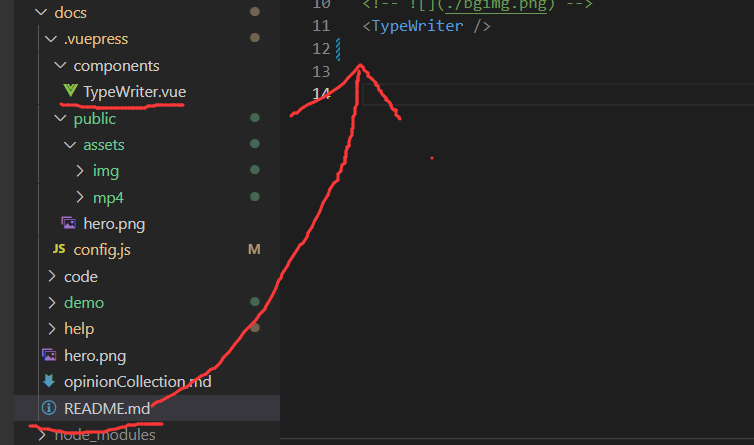
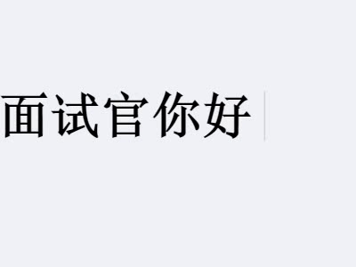

:::tip
实现打字机效果方法有很多，这里展示的是最笨的方法
:::

## 实现方法

&nbsp;&nbsp;&nbsp;&nbsp;&nbsp;&nbsp;&nbsp;最经典的使用动画实现，在本文中使用的是js，向数组中不断填充文字对象实现。  
&nbsp;&nbsp;&nbsp;&nbsp;&nbsp;&nbsp;&nbsp;如果你想了解css实现打字机效果，请参考[animation实现打字机](https://blog.csdn.net/weixin_43742708/article/details/114926809)。  
&nbsp;&nbsp;&nbsp;&nbsp;&nbsp;&nbsp;&nbsp;如果你想了解vue插件实现打字机效果，请参考[vue-typed-js实现打字机](https://blog.csdn.net/qq_43652492/article/details/124085942)或[Vue3实现打字机](https://zhuanlan.zhihu.com/p/462317382)

## 在博客中应用
&nbsp;&nbsp;&nbsp;&nbsp;&nbsp;&nbsp;&nbsp;在vuepress中，所有编写在.vuepress/components下的.vue文件都会被注册为全局组件。

&nbsp;&nbsp;&nbsp;&nbsp;&nbsp;&nbsp;&nbsp;我们在该文件夹下新建文件`TypeWriter.vue`，并填入[代码](./typeWriterCode.md)

&nbsp;&nbsp;&nbsp;&nbsp;&nbsp;&nbsp;&nbsp;在根目录的`README.md`引用即可。  

## 效果显示
&nbsp;&nbsp;&nbsp;&nbsp;&nbsp;&nbsp;&nbsp;不想为了一个gif图片花钱，此处借用的是[知乎liukaili](https://zhuanlan.zhihu.com/p/462317382)，如有冒犯还请联系删除。[好像也没效果😅]

