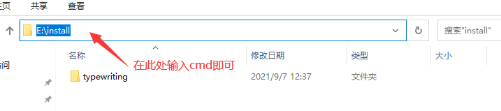
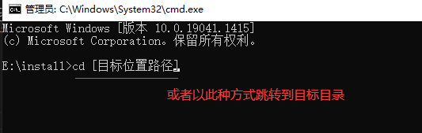
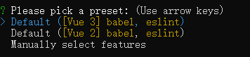

&nbsp;&nbsp;&nbsp;&nbsp;&nbsp;&nbsp;&nbsp;本文讲的是如何创建一个vue的项目，以及项目的初始文件的含义。

## 创建vue项目
&nbsp;&nbsp;&nbsp;&nbsp;&nbsp;&nbsp;&nbsp;在创建vue项目时，我们需要下载[node.js](https://blog.csdn.net/m0_47759019/article/details/121874564)和vue-cli这两项工具，如果您尚未下载，请参考[vue下载与安装](../download//vueDownload.md)，同时若您认为本文所讲内容尚未完善，请参考[vue-cli创建项目](https://blog.csdn.net/qq_52959651/article/details/111047636)。

> 1.在您想要创建项目的位置打开cmd。  

  
  

> 2.vue create [项目名] &nbsp;&nbsp;&nbsp;&nbsp;&nbsp;&nbsp;&nbsp;//创建的项目带有个人特色即可  

> 3.选择使用vue2创建或者vue3创建 &nbsp;&nbsp;&nbsp;&nbsp;&nbsp;&nbsp;&nbsp;//第三个是自己选择配置，如果你选择创建vue3版本的项目，那么你的vue-cli的版本至少为4.5.0，使用npm install -g @vue/cli可以安装或升级脚手架。



> 4.等待项目创建完成，打开即可

## vue项目文件介绍

&nbsp;&nbsp;&nbsp;&nbsp;&nbsp;&nbsp;&nbsp;大家使用的不同版本vue-cli搭建的vue项目目录可能有些不同，博主这里的是最新版的，你可以参照文件名或使用最新版重新搭建。
>node_modules
>>我们下载的依赖都在这里，<span style="color:red">请求：如果你需要一个朋友帮你完善项目代码，请不要将此文件发送给你的朋友。因为此文件太大，还不如让你的朋友自行使用npm i下载依赖。</span>

>public
>>favicon.ico &nbsp;&nbsp;&nbsp;&nbsp;&nbsp;&nbsp;&nbsp;//项目图标，即网页页签旁的图标
>>index.html &nbsp;&nbsp;&nbsp;&nbsp;&nbsp;&nbsp;&nbsp;//项目的入口，所有的页面都是从这里开始

>src
>>assets &nbsp;&nbsp;&nbsp;&nbsp;&nbsp;&nbsp;&nbsp;//一般存储着项目的图片等静态资源
>>components &nbsp;&nbsp;&nbsp;&nbsp;&nbsp;&nbsp;&nbsp;//我们所写的/.vue文件存放的位置
>>App.vue &nbsp;&nbsp;&nbsp;&nbsp;&nbsp;&nbsp;&nbsp;//我们所写的\/.vue文件的父组件.
>>main.js &nbsp;&nbsp;&nbsp;&nbsp;&nbsp;&nbsp;&nbsp;//下载插件的定义和声明的位置

>babel.config.js &nbsp;&nbsp;&nbsp;&nbsp;&nbsp;&nbsp;&nbsp;// babel的控制文件，即涉及ES语法转换问题，

>jsconfig.json &nbsp;&nbsp;&nbsp;&nbsp;&nbsp;&nbsp;&nbsp;//javascript服务选项，详细请参考[vscode jsconfig.json 使用说明](https://blog.csdn.net/zengzeng011/article/details/103889282)

>package.json 
>package-lock.json &nbsp;&nbsp;&nbsp;&nbsp;&nbsp;&nbsp;&nbsp;//这两个文件指示的是依赖包管理，例如下载的插件的版本、vue版本等

>README.md &nbsp;&nbsp;&nbsp;&nbsp;&nbsp;&nbsp;&nbsp;//提示文档不重要

>vue.config.js &nbsp;&nbsp;&nbsp;&nbsp;&nbsp;&nbsp;&nbsp;//这是一个可选的配置，例如我们配置代理服务器

>yarn.lock &nbsp;&nbsp;&nbsp;&nbsp;&nbsp;&nbsp;&nbsp;//包含有关已安装的每个依赖项的确切版本的信息以及代码的校验和以确保代码完全相同。

&nbsp;&nbsp;&nbsp;&nbsp;&nbsp;&nbsp;&nbsp;在src文件中，我们完全可以按照自己的习惯将各种文件、资源放在不同的位置，再保证不会造成误解、影响阅读的情况下，合理的存放文件。

### render(v2)和createApp(v3)
&nbsp;&nbsp;&nbsp;&nbsp;&nbsp;&nbsp;&nbsp;我们好像并没有和大家介绍过，在正常的.html文件中去使用vue编写，下面我们简单介绍一下这种写法并解释我们为什么需要render和createApp函数。
```
  <div id="root">
    <h1>Hello，{{student}}</h1>
  </div>

  <script type="text/javascript" src="../js/vue.js"></script> //引入我们需要的vue.js文件

  <script type="text/javascript">
    Vue.config.productionTip = false //阻止 vue在启动时生成生产提示。
    new Vue({
      el:'#root' / document.getElementById('root'),     // 为构建的vue实例选择一个容器，让实例为选择的容器服务
      data:{         // data有两种写法，对象式和函数式。
        student:'张三',
      }
      data(){
        return {
          student:'张三',
        }
      }
    })
  </script>
```
&nbsp;&nbsp;&nbsp;&nbsp;&nbsp;&nbsp;&nbsp;data的两种形式各有区别，在初学时，我们写对象式或者函数式没有区别，只有当我们学习到组件时，vue才会明确的要求我们使用函数式。所以为了养成习惯，我们以后的写法中都以函数式为准。  
&nbsp;&nbsp;&nbsp;&nbsp;&nbsp;&nbsp;&nbsp;当然为了说明render和createApp的作用，我们还得使用这种形式去定义一个组件，如下。  
```
  <div id="root">
    <school></school>     // 使用组件
    <school></school>     // 使用组件
  </div>
  <script type="text/javascript">
    Vue.config.productionTip = false //阻止 vue在启动时生成生产提示。
    const school = Vue.extend({     //定义组件
      templete:'<h1>{{school}}</h1>'
      data(){
        return{
          school:'123大学'
        }
      }
    })
    new Vue({
      el:'#root',
      components:{school}   //引入注册组件
    })
  </script>
```
&nbsp;&nbsp;&nbsp;&nbsp;&nbsp;&nbsp;&nbsp;这里我简单展示了下组件的定义。上文中我们提到过在组件中的data为函数式的原因是：组件在定义创建后可能被多个其他组件使用，但对象式因为大家都是引用的同一个地址，导致某个组件内引入的内容发生更改时，其他组件引入的内容也随之发生更改，而函数式则是将data的数据以返回值的方式供引用者使用，每次引用时拿到的都是一个新的函数对象，两两之间互不干扰。    
&nbsp;&nbsp;&nbsp;&nbsp;&nbsp;&nbsp;&nbsp;介绍完函数式和对象式data的区别和使用函数式的原因，下面我们回到正题，我们为什么要使用render和createApp？  
&nbsp;&nbsp;&nbsp;&nbsp;&nbsp;&nbsp;&nbsp;在整个vue的项目中有一个最大的组件App，它包裹着整个项目，我们编写的所有组件都可算作为其的子孙后代，render和createApp的作用简单来说就是将App组件绑定到指定的容器中。那么新的问题来了，如果仅仅是需要将其放入容器，我们有很多办法的，例如上文代码片段中的templete属性，vue的开发团队何苦搞一个新的东西出来呢？  
&nbsp;&nbsp;&nbsp;&nbsp;&nbsp;&nbsp;&nbsp;在我们日常的项目编码中，我们往往写过这样的代码`import Vue from 'Vue'`，这代表着我们引入了vue的核心库，但是在项目中，默认引入的却不是完整的vue.js，而是一个名为vue.runtime.esm.js的阉割版库，它能完成vue.js的大部分功能，只是缺少了模版解析器，因此不能识别templete属性定义的模版，所以vue团队引入了render，至于引入vue.runtime.esm.js的阉割版库是为了在webpack打包时的代码体积能小一点，大概100K+。  
&nbsp;&nbsp;&nbsp;&nbsp;&nbsp;&nbsp;&nbsp;至于vue3中使用的createApp在完成render任务的基础上，也实现了两个vue实例的功能完全独立的任务。详情请参考[render和createApp](https://www.csdn.net/tags/NtTaUg3sMzQ1NzctYmxvZwO0O0OO0O0O.html)