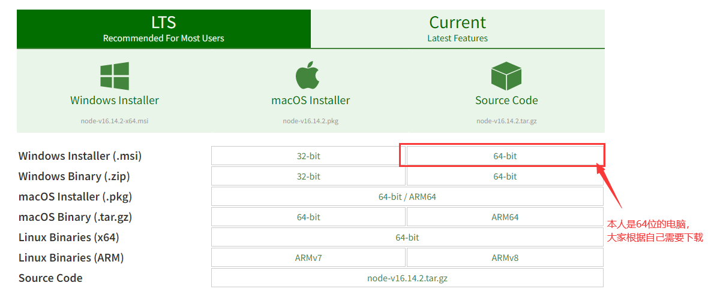
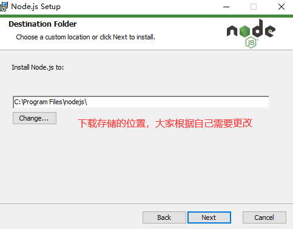
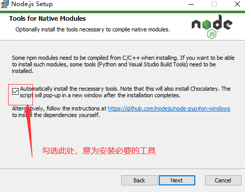
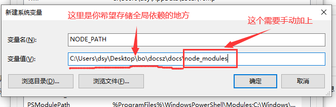
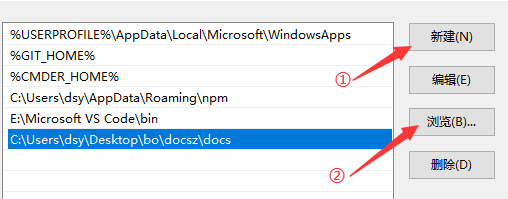
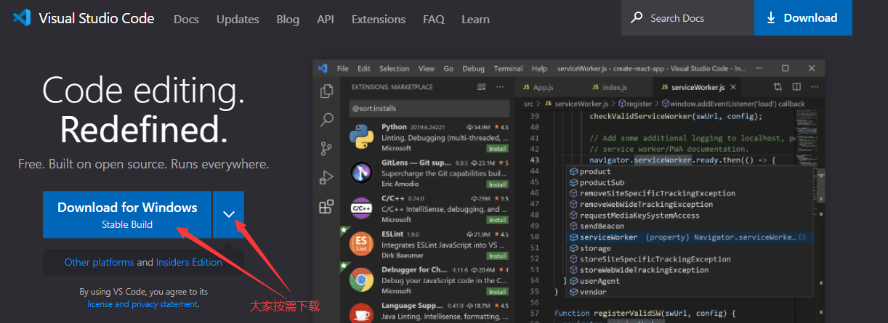
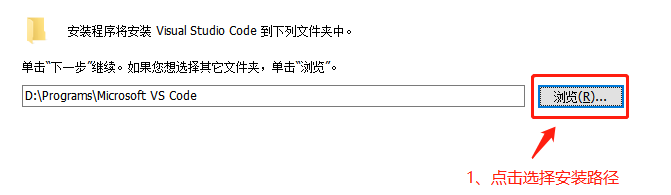
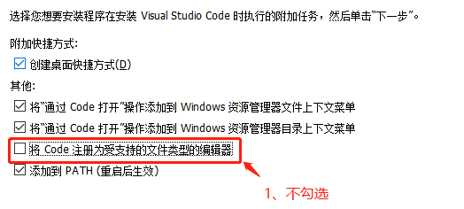

&nbsp;&nbsp;&nbsp;&nbsp;&nbsp;&nbsp;&nbsp;想要使用vue编写前端代码，需要大家安装node.js、vscode（Visual Studio Code）和vue-cli（脚手架，搭建项目使用）。

## node.js
&nbsp;&nbsp;&nbsp;&nbsp;&nbsp;&nbsp;&nbsp;如果您觉得本人讲的不是全面， 请参考[node.js安装](https://blog.csdn.net/m0_47759019/article/details/121874564)

1. 打开官网下载地址[官网下载地址](https://nodejs.org/en/download/)  
2. 下载文件。根据个人电脑情况选择适配的文件，如下图（QQ截图，有点模糊，还请大家见谅）  

3. 下载完成后双击打开。一直点next即可

4. 修改全局安装配置的安装位置（非必须，默认安装在c盘，C盘容量不是很充足的建议修改）
>>（1）我的电脑-右键-属性-高级系统设置-高级-环境变量
>>（2）win图标旁的搜索符号-搜索编辑系统环境变量-高级-环境变量
>>（3）新建系统变量

>>（4）添加个人path配置（双击path）

## vscode
&nbsp;&nbsp;&nbsp;&nbsp;&nbsp;&nbsp;&nbsp;如果您觉得本人讲的不是全面， 请参考[vscode安装](https://blog.csdn.net/Passerby_Wang/article/details/122179913)

1. [官网](https://code.visualstudio.com/)下载app文件&nbsp;&nbsp;&nbsp;&nbsp;&nbsp;&nbsp;&nbsp;  
2. 下载文件。根据个人电脑情况选择适配的文件，如下图  

3. 下载完成后双击打开，一直点next即可  

***
  
4. 等待安装即可  
5. [插件安装](../../help/plugInUnit.md)（很多插件都早就已经安装过了，因此介绍的可能不是很全面）

## vue-cli
&nbsp;&nbsp;&nbsp;&nbsp;&nbsp;&nbsp;&nbsp;用于搭建vue项目的工具，在前端项目中。若选择vue作为开发语言，那么在项目搭建阶段的代码大致相同，我们不需要每次都去编写相同且数量庞大的代码（而且对于一般人，不使用脚手架搭建项目是相当困难的），因此我们需要一个工具去帮助我们完成前期的工作，这个工具就是vue-cli。
> 1. win+R呼出任务，输入cmd，打开命令提示符  
> 2. npm install -g @vue/cli  或者 yarn global add @vue/cli  
> \#&nbsp;&nbsp;npm是下载node后就可以使用，yarn则需要添加（命令为：npm install -g yarn）  
> 3. 等待安装结束  
> 4. 使用vue -V 或 vue --version查看版本，出现版本号即为成功   
> 5. [使用vue搭建一个项目](../basis/vuecli.md)    

## help
&nbsp;&nbsp;&nbsp;&nbsp;&nbsp;&nbsp;&nbsp;若您在安装过程中出现任何问题，请询问百度或联系博主（一般情况下都是有空的）亦或者是重新安装。

    
