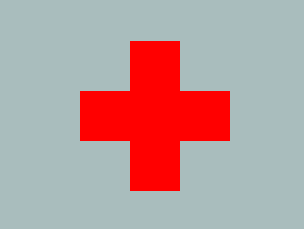

&nbsp;&nbsp;&nbsp;&nbsp;&nbsp;&nbsp;&nbsp;'三栏'布局其实就是为了实现一个两侧宽度固定，中间宽度自适应，且中间栏要先渲染布局，如下:  
&nbsp;&nbsp;&nbsp;&nbsp;&nbsp;&nbsp;&nbsp;   

### 圣杯模型
&nbsp;&nbsp;&nbsp;&nbsp;&nbsp;&nbsp;&nbsp;圣杯布局的三栏都是`float:left`浮动，在于解决中间栏`div`的内容不被遮挡的问题上，圣杯布局是中间栏在添加相对定位，并配合`left`和`right`属性，效果上表现为三栏是单独分开的（如果可以看到空隙的话）。
```html
<!-- 布局基本结构  -->
<div class="main">
  <div class="center"></div>
  <div class="left"></div>
  <div class="right"></div>
</div>
```
```css
<style>
.main{
    padding: 0 100px;
}
.left,.right{
    width:100px;
    height: 100px;
}
.center{       /*中间栏样式*/
    width: 100%;      /*宽度撑开*/
    height: 100px; 
    float: left;        /*设置左浮动*/
    background: yellow;   /*三栏颜色区分*/
} 
.left{
    float: left;
    background: red;
    margin-left: -100%;   
    position: relative;     /* 相对浮动: 相对于原始位置进行移动*/
    left: -100px;  /* 向左移动-100px */
}
.right{
    float: left;
    background: green;
    margin-left: -100px;
    position: relative;
    left: 100px;
}
</style>
```

### 双飞翼布局
&nbsp;&nbsp;&nbsp;&nbsp;&nbsp;&nbsp;&nbsp;双飞翼布局是在中间栏的`div`中嵌套一个`div`，内容写在嵌套的`div`里，然后对嵌套的`div`设置`margin-left`和`margin-right`，效果上表现为左右两栏在中间栏的上面，中间栏还是100%宽度，只不过中间栏的内容通过`margin`的值显示在中间。 
```html
<!-- 布局基本结构  -->
<div class="main">
  <div class="center">
    <div class="child"></div>
  </div>
  <div class="left"></div>
  <div class="right"></div>
</div>
``` 
```css
<style>
.center{       
    width: 100%;      
    height: 100px; 
    float: left;        
    background: yellow;   
} 
.left{
    float: left;  
    height: 100px;
    width: 100px;
    background: red;
    margin-left: -100%;   
}
.right{
    float: left;
    height: 100px;
    width: 100px;
    background: green;
    margin-left: -100px;
}
.child{
    margin: 0 100px;   /* 设置所有外边距，为两翼留下空间 */ 
    background: aqua; 
    height: 100%;
}
</style>
```
&nbsp;&nbsp;&nbsp;&nbsp;&nbsp;&nbsp;&nbsp;当前在现在前端ui组件库中很多都对布局结构做了封装，但还是希望大家了解一下，这类的三栏布局的实现，万一让你自己写呢！

### css画十字
&nbsp;&nbsp;&nbsp;&nbsp;&nbsp;&nbsp;&nbsp;在前端笔试题中有一个比较有意思，使用2、3、5个div实现居中十字架效果，如下:
&nbsp;&nbsp;&nbsp;&nbsp;&nbsp;&nbsp;&nbsp;  
```html
<!-- div结构 -->
<div id="d1"></div>  
<div id="d2"></div>
<div id="d3"></div>  
<div id="d4"></div>
<div id="d5"></div>  
```
```css
/* 两个div */
div{  
  background:red;   
  position:absolute;  /* 居中 */
  top:50%;     
  left:50%;  
  width:50px;    /* 设置自身宽高 */
  height:50px;  
}  
#d1{  
  width:150px;   /* 重设宽度，会覆盖以前的 */
  margin: -25px 0px 0px -75px;   /* 设置边距，使两个div交汇 */
}  
#d2{  
  height:150px;  
  margin: -75px 0px 0px -25px;  
} 
```
```css
/* 三个div */
div{  
  background:red;   
  position:absolute;  
  top:50%;  
  left:50%;  
  width:50px;  
  height:50px;  
}  
#d1{  
  margin: -75px 0px 0px -25px;  
}  
#d2{  
  width:150px;     /* 三个div的一种实现方法，以宽度为主轴，还可以以高度为主轴，方法类似 */
  margin: -25px 0px 0px -75px;  
}  
#d3{  
  margin: 25px 0px 0px -25px;  
} 
```
```css
/* 五个div */
div{  
  background:red;   
  position:absolute;  
  width:50px;  
  height:50px;  
  top:50%;  
  left:50%;  
}  
#d1{  
  margin: -75px 0px 0px -25px;    /* 上 */ 
}  
#d2{  
  margin: -25px 0px 0px -25px;    /* 中 */ 
}  
#d3{  
  margin: -25px 0px 0px -75px;    /* 左 */
}  
#d4{  
  margin: -25px 25px 0px 0px;     /* 右 */
}  
#d5{  
  margin: 25px 0px 0px -25px;     /* 下 */
}  
```


