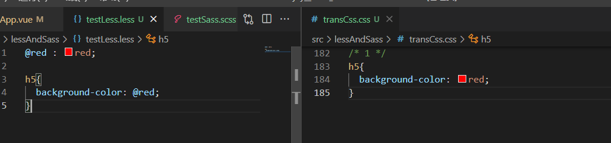
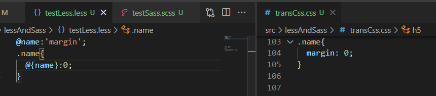
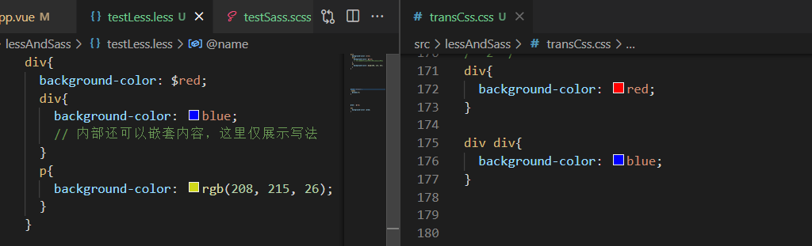
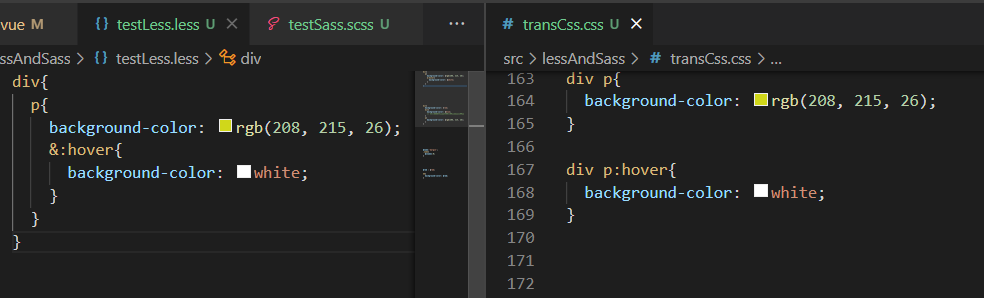
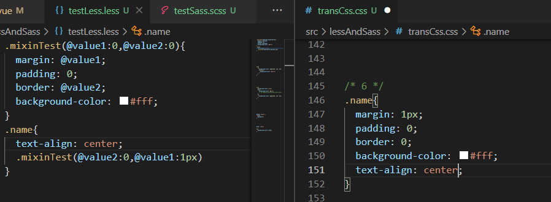
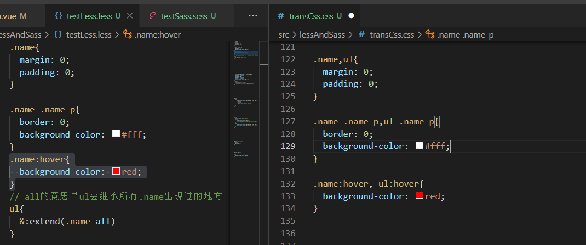

## 什么是 CSS 预处器

&nbsp;&nbsp;&nbsp;&nbsp;&nbsp;&nbsp;&nbsp;通俗的说，CSS预处理器用一种专门的编程语言，进行Web页面样式设计，然后再编译成正常的CSS文件，以供项目使用。CSS 预处理器为CSS增加一些编程的特性，可以在CSS中使用变量、简单的逻辑程序、函数等等在编程语言中的一些基本特性，可以让CSS更加简洁、适应性更强、可读性更佳，易于维护等诸多好处。

### 背景介绍
&nbsp;&nbsp;&nbsp;&nbsp;&nbsp;&nbsp;&nbsp;LESS由Alexis Sellier于2009年设计。LESS是一个开源。LESS的第一个版本是用Ruby编写的，在后来的版本中，它被JavaScript代替，在一定程度上也促进了sass的进化，但由于程序员习惯或其它原因，使用率上不及sass。

## sass => css
&nbsp;&nbsp;&nbsp;&nbsp;&nbsp;&nbsp;&nbsp;安装less处理工具在vue项目中，使用`npm install -g less`安装即可，在客户端下可以使用编译工具[koala](http://koala-app.com/index-zh.html)。  
&nbsp;&nbsp;&nbsp;&nbsp;&nbsp;&nbsp;&nbsp;在B站上有很多的less预处理器的教程，这里推荐的是较为简洁的，[尚硅谷前端less教程](https://www.bilibili.com/video/BV1YW411T7vd?spm_id_from=333.999.0.0)。 


### 避免编译
&nbsp;&nbsp;&nbsp;&nbsp;&nbsp;&nbsp;&nbsp;有时候，对于一些特殊的代码，我们不希望由less转为css过程中，处理器帮我们处理，希望它展示以前的样子。
`~"不希望被编译的内容"`

### 项目准备
&nbsp;&nbsp;&nbsp;&nbsp;&nbsp;&nbsp;&nbsp;需要准备两个文件夹分别保存处理前的`.less`文件和处理后的`.css`文件。
```less
less/     // 该目录存储scss文件
css/      // 该目录存储css文件
```

## less语法

### less变量
&nbsp;&nbsp;&nbsp;&nbsp;&nbsp;&nbsp;&nbsp;less可以定义一个变量，定义方式为`@name = value`，作为变量，其作用的范围受作用域限制。  
  
&nbsp;&nbsp;&nbsp;&nbsp;&nbsp;&nbsp;&nbsp;当然变量不会局限于定义value值，也可以定义key、选择器等。使用是需要`@{variable}`，这种写法虽然被允许但不推荐。  
   

<span style="color:red">&nbsp;&nbsp;&nbsp;&nbsp;&nbsp;&nbsp;&nbsp;less有一个特殊的点。变量的延迟加载：会等某个作用域的所有变量都声明完成后才会去赋值。</span>  

### less嵌套语法
&nbsp;&nbsp;&nbsp;&nbsp;&nbsp;&nbsp;&nbsp;在css文件中，对于一个嵌套层级较深的层级来说，要拿到内层的元素需要一层一层的取，当内层元素较多时，定位标签时，往往编写了大量的重复代码，费时费力且不易维护。  
&nbsp;&nbsp;&nbsp;&nbsp;&nbsp;&nbsp;&nbsp;在less中，编写代码可以嵌套这些，就像是在html的层级一样，方便后期维护。  
```html
html:
  <div class="name">
    <div>
      <ul>
        <li></li>
        <li></li>
      </ul>
      <a href=""></a>
    </div>
    <p class="name-p"></p>
  </div>
```
<span style="color:red">&nbsp;&nbsp;&nbsp;&nbsp;&nbsp;&nbsp;&nbsp;在本文出现的实例代码毫无逻辑可言，也是可能是不推荐的写法，在本文中的作用仅是示例而已。</span>  
  
  

&nbsp;&nbsp;&nbsp;&nbsp;&nbsp;&nbsp;&nbsp;在sass中，当需要编写`：hover`、`:focus`等选择器时，需要添加连接符`&`。

   

### 属性复用
#### 混合
&nbsp;&nbsp;&nbsp;&nbsp;&nbsp;&nbsp;&nbsp;类似于sass中的混合mixin，不过定义的方法不同，而且其相当于一个`类选择器`。当混合被调用时，混合会将自身的属性全部放入引用的位置。
```less
// 定义
.mixinName(vlaue1,value2,...){
  // 在下图中，我们会给一个示例供大家理解。
}
```
   
<span style="color:red">&nbsp;&nbsp;&nbsp;&nbsp;&nbsp;&nbsp;&nbsp;在此处还有个需要注意的地方：当我们定义的混合没有参数时，我们可以选择不写`()`，但此时该混合也会被当做类选择器，从而被编译到`.css`文件中，但它却并不是我们希望的。</span>  
<span style="color:red">&nbsp;&nbsp;&nbsp;&nbsp;&nbsp;&nbsp;&nbsp;&nbsp;&nbsp;&nbsp;&nbsp;&nbsp;&nbsp;&nbsp;1. 定义引用混合时是可以传递参数的。如果定义了初始值，在没有传值的情况下会使用初始定义的值。</span>  
<span style="color:red">&nbsp;&nbsp;&nbsp;&nbsp;&nbsp;&nbsp;&nbsp;&nbsp;&nbsp;&nbsp;&nbsp;&nbsp;&nbsp;&nbsp;2. 引用时传递的参数应按照定义时的顺序。</span>  
<span style="color:red">&nbsp;&nbsp;&nbsp;&nbsp;&nbsp;&nbsp;&nbsp;&nbsp;&nbsp;&nbsp;&nbsp;&nbsp;&nbsp;&nbsp;3. 如果指定了参数的值，如图中所示，则也可以不按顺序。</span>   

#### extend继承
&nbsp;&nbsp;&nbsp;&nbsp;&nbsp;&nbsp;&nbsp;当两个类的内容大致一致时，我们当然可以把公共部分抽离出去定义为一个`混合`来减少代码编写，在这里我们介绍的是继承。  
&nbsp;&nbsp;&nbsp;&nbsp;&nbsp;&nbsp;&nbsp;继承，简单来说就是继承者将获得被继承着的一切，当然被继承着所拥有的内容也不会被删除。  
   

### 注释
&nbsp;&nbsp;&nbsp;&nbsp;&nbsp;&nbsp;&nbsp;less为我们提供了两种种注释的写法，如下：  
```less
1. 双斜线的单行注释：
  // 我是单行注释
2. 斜线加星号的多行注释
  /*
    这里是多行注释
    这里的注释内容即使经历编译也会以多行注释的形式展示在编译后的css文件中，
  */
```

### 变量及方法
&nbsp;&nbsp;&nbsp;&nbsp;&nbsp;&nbsp;&nbsp;因为平时使用less真不多，当初学习时，老师也没有整理less中声明变量的类型和方法，因此对其了解不多，还请见谅。


