## 什么是 CSS 预处器

&nbsp;&nbsp;&nbsp;&nbsp;&nbsp;&nbsp;&nbsp;通俗的说，CSS预处理器用一种专门的编程语言，进行Web页面样式设计，然后再编译成正常的CSS文件，以供项目使用。CSS 预处理器为CSS增加一些编程的特性，可以在CSS中使用变量、简单的逻辑程序、函数等等在编程语言中的一些基本特性，可以让CSS更加简洁、适应性更强、可读性更佳，易于维护等诸多好处。

### 背景介绍
&nbsp;&nbsp;&nbsp;&nbsp;&nbsp;&nbsp;&nbsp;SASS(.scss)。于2007年诞生，最早也是最成熟的CSS预处理器，拥有ruby社区的支持和compass这一最强大的css框架，目前受LESS影响，已经进化到了全面兼容CSS的SCSS(本文中以sass称呼)。

## sass => css
&nbsp;&nbsp;&nbsp;&nbsp;&nbsp;&nbsp;&nbsp;安装sass处理工具，在B站上有很多的教程，这里推荐的是较为简洁的，[【Web前端】Sass基础](https://www.bilibili.com/video/BV17W411w7nL?p=3)；博主当时看的是[SCSS从入门到实战](https://www.bilibili.com/video/BV1Zg4y1v75U?spm_id_from=333.999.0.0)，这个视频略显繁琐。如果不关心安装过程请从13集观看。  

### 项目准备
&nbsp;&nbsp;&nbsp;&nbsp;&nbsp;&nbsp;&nbsp;需要准备两个文件夹分别保存处理前的`.scss`文件和处理后的`.css`文件。
```
sass/     // 该目录存储scss文件
css/      // 该目录存储css文件
```
&nbsp;&nbsp;&nbsp;&nbsp;&nbsp;&nbsp;&nbsp;在我们编译好`.scss`文件，使用命令`sass sass/test.scss:css/test.css`，转换为常见的`.css`文件。当然如果不想一遍遍的转化，也可以使用自动监视watch。命令为`sass --watch sass:css`。

## sass语法

### sass变量
&nbsp;&nbsp;&nbsp;&nbsp;&nbsp;&nbsp;&nbsp;sass可以定义一个变量，定义方式为`$name = value`，作为变量，其作用的范围受作用域限制，在类选择器内定义时，也可以加上`!global`转化局部变量为全局变量。
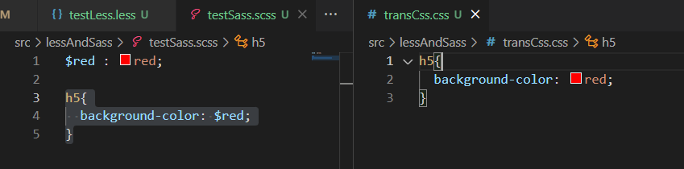  
&nbsp;&nbsp;&nbsp;&nbsp;&nbsp;&nbsp;&nbsp;当然变量不会局限于定义value值，也可以定义key、选择器等。使用是需要`#{variable}`
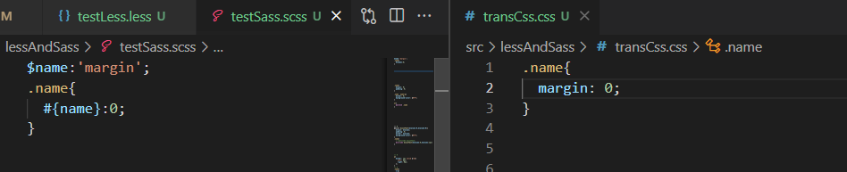   

#### number及相关函数
&nbsp;&nbsp;&nbsp;&nbsp;&nbsp;&nbsp;&nbsp;number是sass中的一种数据类型，`5`是number类型，`5px`同样也是number类型，数字间同样可以进行加减乘除，相应的也要遵守四则运算规则，另外的，当数字类型带单位进行乘法运算时，最多只允许乘法的一方携带单位，在sass乘法运算中，单位也会参与预算，如`1cm*1cm=1cm2`。 
&nbsp;&nbsp;&nbsp;&nbsp;&nbsp;&nbsp;&nbsp;在sass中还有为数字提供的一些函数，如下：
+ abs():取绝对值
+ round():四舍五入
+ ceil():向上取整
+ floor():向下取整
+ percentage():取百分比
+ min():取最小的
+ max():取最大的

#### string及相关函数
&nbsp;&nbsp;&nbsp;&nbsp;&nbsp;&nbsp;&nbsp;number也是sass中的一种数据类型，`'name'`和`name`都算作是字符串，同样可以运用运算符连接字符串，如下:
```
name + 'space'  ==> 'namespace'
name - 800      ==> 'name-800'
name / dog      ==> 'name/dog'
```
&nbsp;&nbsp;&nbsp;&nbsp;&nbsp;&nbsp;&nbsp;在sass中还有为字符串提供的一些函数，如下：
+ to-upper-case():全部转为大写
+ to-lower-case():全部转为小写
+ str-length():返回字符串长度
+ str-index(String,childrenStr) 返回指定字符在字符串中首次出现的位置
+ str-insert(String,insertStr,'位置') 插入字符串

#### color及相关函数
&nbsp;&nbsp;&nbsp;&nbsp;&nbsp;&nbsp;&nbsp;color也是sass中的一种数据类型，`rgb()`、`rgba()`和`red`都算作是color。  
&nbsp;&nbsp;&nbsp;&nbsp;&nbsp;&nbsp;&nbsp;在sass中还有为color提供的一些函数，如下：
+ hsl(`色相：0°-360°`,`饱和度：0-100%`,`明度：0-100%`)
+ hsla(`色相：0°-360°`,`饱和度：0-100%`,`明度：0-100%`,`透明度`)
+ adjust-hue(`颜色`,`参数`):可以调整色相的值
+ lighten(`颜色`,`百分数`):让颜色更白
+ darken(`颜色`,`百分数`) :让颜色更黑
+ saturate(`颜色`,`百分数`):增加颜色的纯度，也就是饱和度
+ desaturate(`颜色`,`百分数`) :减少颜色的纯度
+ opacify(`颜色`,`小数`):增加不透明度
+ transparentize(`颜色`,`小数`) :减少不透明度


#### list及相关函数
&nbsp;&nbsp;&nbsp;&nbsp;&nbsp;&nbsp;&nbsp;list也是sass中的一种数据类型，`1px solid red`、`0 0 0 0`和`1px,1px`都算作是list，在sass中list的分隔符可以是空格、逗号、括号等。当一个数据中出现多总分隔符时会被认定为多个列表，如下：  
```
padding: 5px 10px, 5px 0;   // 这是两个列表list
```
&nbsp;&nbsp;&nbsp;&nbsp;&nbsp;&nbsp;&nbsp;在sass中还有为list提供的一些函数，如下：
+ length():返回列表项目个数
+ nth('list','序号'):得到对应序号里边的数据
+ index('list','value'):判断指定项目在列表里的位置
+ append('list','value','分隔符【可选】'):向列表追加项目
+ join('list','value','分隔符【可选】'):组合列表

#### Map及相关函数
&nbsp;&nbsp;&nbsp;&nbsp;&nbsp;&nbsp;&nbsp;map也是sass中的一种数据类型，`(light: #ffffff, dark: #000000)`算作是map。  
&nbsp;&nbsp;&nbsp;&nbsp;&nbsp;&nbsp;&nbsp;在sass中还有为map提供的一些函数，如下：
+ length():查看变量中有几个键值对。
+ map-get(`map`,`key`):可以根据键来得到值
+ map-keys(`map`):返回对象当中的所有 key
+ map-values(`map`):返回对象当中所有的 value
+ map-has-key(`map`,`key`):判断对象当中是否有指定的 key
+ map-merge(`map`, `map`) 把两个 Map 合并到一起
+ map-remove(`map`,`key`):移除指定的键值对
+ map-has-key(`map`,`key`):判断对象当中是否有指定的 key
+ map-has-key(`map`,`key`):判断对象当中是否有指定的 key

#### boolean布尔值
&nbsp;&nbsp;&nbsp;&nbsp;&nbsp;&nbsp;&nbsp;boolean也是sass中的一种数据类型，`true/false`算作是boolean。  

### sass嵌套语法
&nbsp;&nbsp;&nbsp;&nbsp;&nbsp;&nbsp;&nbsp;在css文件中，对于一个嵌套层级较深的层级来说，要拿到内层的元素需要一层一层的取，当内层元素较多时，定位标签时，往往编写了大量的重复代码，费时费力且不易维护。  
&nbsp;&nbsp;&nbsp;&nbsp;&nbsp;&nbsp;&nbsp;在sass中，编写代码可以嵌套这些，就像是在html的层级一样，方便后期维护。  
```
html:
  <div class="name">
    <div>
      <ul>
        <li></li>
        <li></li>
      </ul>
      <a href=""></a>
    </div>
    <p class="name-p"></p>
  </div>
```
<span style="color:red">&nbsp;&nbsp;&nbsp;&nbsp;&nbsp;&nbsp;&nbsp;在本文出现的实例代码毫无逻辑可言，也是可能是不推荐的写法，在本文中的作用仅是示例而已。</span>  
  
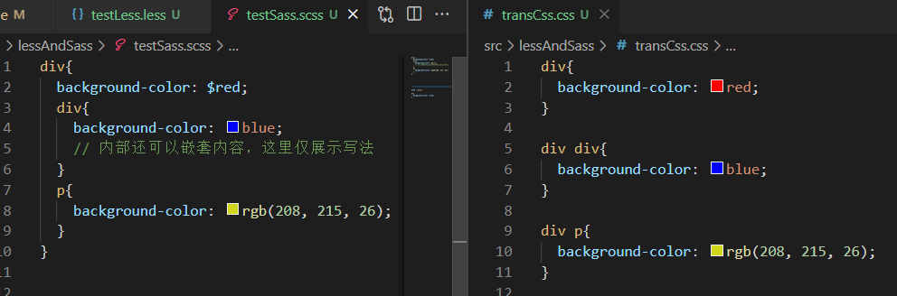  

&nbsp;&nbsp;&nbsp;&nbsp;&nbsp;&nbsp;&nbsp;在sass中，当需要编写`：hover`、`:focus`等选择器时，需要添加连接符`&`。

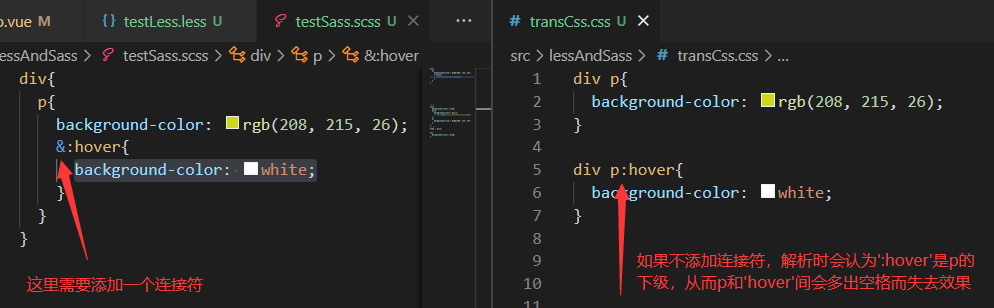   

&nbsp;&nbsp;&nbsp;&nbsp;&nbsp;&nbsp;&nbsp;在sass中，如果子选择器的的一部分是父选择器，也可以使用连接符`&`引用父选择器。  

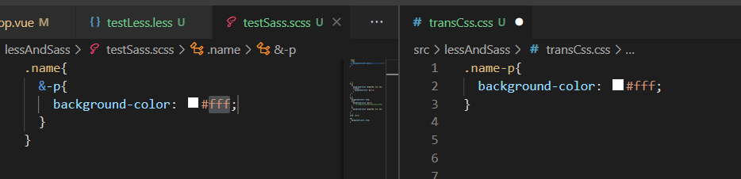   

&nbsp;&nbsp;&nbsp;&nbsp;&nbsp;&nbsp;&nbsp;在sass中，类可以嵌套，属性也可以。

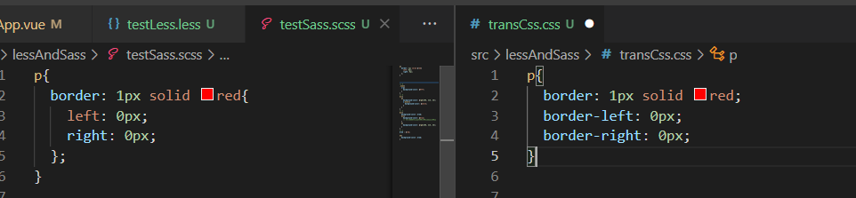   

### 属性复用
#### mixin
&nbsp;&nbsp;&nbsp;&nbsp;&nbsp;&nbsp;&nbsp;如果看过本人写的vue文章，应该对`mixin`不陌生，简单来说，`mixin`就是定义的是一个可供当前所有选择使用的公共属性。定义方式如下：
```
// 定义
@mixin mixinName(vlaue1,value2,...){
  // 在下图中，我们会给一个示例供大家理解。
}
```
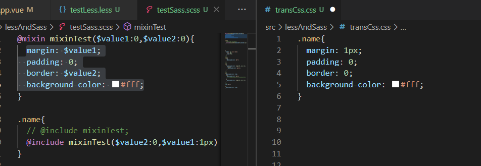   
&nbsp;&nbsp;&nbsp;&nbsp;&nbsp;&nbsp;&nbsp;通过图例大家应该大致知道定义`mixin`需要使用`@mixin`，当调用时，则需要用到`@include`。同时还有一些需要注意的点，如下：  
<span style="color:red">&nbsp;&nbsp;&nbsp;&nbsp;&nbsp;&nbsp;&nbsp;&nbsp;&nbsp;&nbsp;&nbsp;&nbsp;&nbsp;&nbsp;1. 定义引用mixin时是可以传递参数的。如果定义了初始值，在没有传值的情况下会使用初始定义的值。</span>  
<span style="color:red">&nbsp;&nbsp;&nbsp;&nbsp;&nbsp;&nbsp;&nbsp;&nbsp;&nbsp;&nbsp;&nbsp;&nbsp;&nbsp;&nbsp;2. 引用时传递的参数应按照定义时的顺序。</span>  
<span style="color:red">&nbsp;&nbsp;&nbsp;&nbsp;&nbsp;&nbsp;&nbsp;&nbsp;&nbsp;&nbsp;&nbsp;&nbsp;&nbsp;&nbsp;3. 如果指定了参数的值，如图中所示，则也可以不按顺序。</span>   

#### extend继承
&nbsp;&nbsp;&nbsp;&nbsp;&nbsp;&nbsp;&nbsp;当两个类的内容大致一致时，我们当然可以把公共部分抽离出去定义为一个`mixin`来减少代码编写，在这里我们介绍的是继承。  
&nbsp;&nbsp;&nbsp;&nbsp;&nbsp;&nbsp;&nbsp;继承，简单来说就是继承者将获得被继承着的一切，当然被继承着所拥有的内容也不会被删除。  
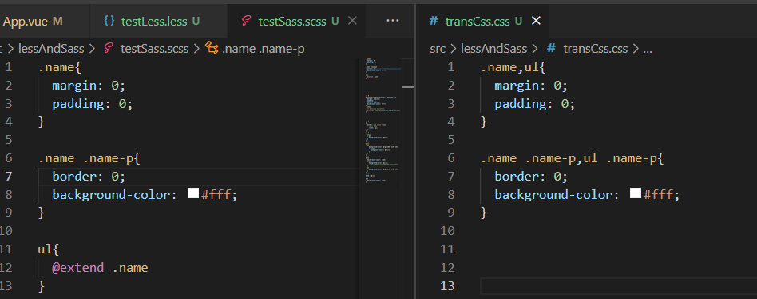   

#### 自定义函数
&nbsp;&nbsp;&nbsp;&nbsp;&nbsp;&nbsp;&nbsp;当`extend`和`mixin`无法满足我们的要求时，比如需要判断、控制等情况时，貌似没有很好地解决方法，其实在sass中还有第三种公用数据的方法，自定义函数。  
   

### 流程控制语句

#### @if
&nbsp;&nbsp;&nbsp;&nbsp;&nbsp;&nbsp;&nbsp;同在js判断中一样，选择满足条件的路径。  
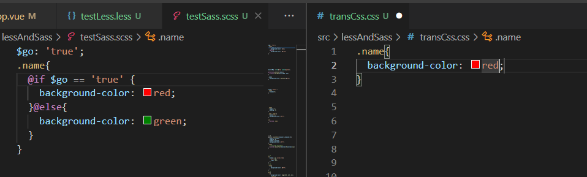   

#### @for
&nbsp;&nbsp;&nbsp;&nbsp;&nbsp;&nbsp;&nbsp;同在js循环条件一样，知道条件不满足时取消循环。例如  
```
@for $i from 开始值 through 结束值   // 相当于 ≤
@for $i from 开始值 to 结束值        // 相当于 <
 
```
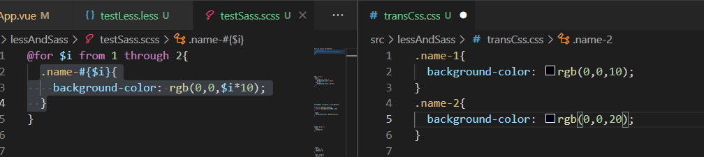   

#### @each in
&nbsp;&nbsp;&nbsp;&nbsp;&nbsp;&nbsp;&nbsp;在sass中，还有一个循环是用来遍历列表的——`@each in`。  
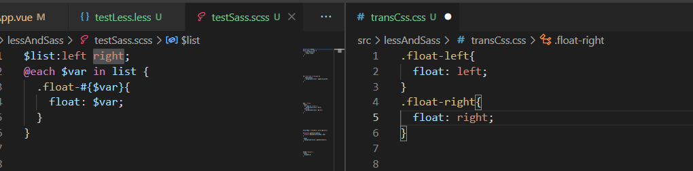   

#### @while
&nbsp;&nbsp;&nbsp;&nbsp;&nbsp;&nbsp;&nbsp;同在js循环条件一样，知道条件不满足时取消循环。  
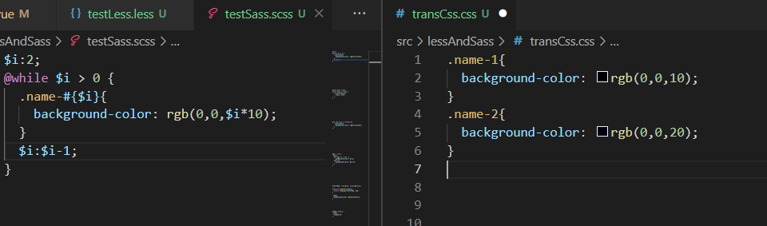   

### @import
&nbsp;&nbsp;&nbsp;&nbsp;&nbsp;&nbsp;&nbsp;受组件化编码的影响，我们编写的样式可能在不同的文件中，这时就需要使用`@import`引入，如下：  
```
正常引入：@import "main.scss";
Partials引入：@import "base";
```
&nbsp;&nbsp;&nbsp;&nbsp;&nbsp;&nbsp;&nbsp;如果使用Partials引入，要求被引入的scss文件命名以`_`开头，此时引入可以不带后缀名。

### 注释
&nbsp;&nbsp;&nbsp;&nbsp;&nbsp;&nbsp;&nbsp;sass为我们提供了三种注释的写法，如下：
```
1. 双斜线的单行注释：
  // 我是单行注释
2. 斜线加星号的多行注释
  /*
    这里是
    多行注释
  */
3. 斜线、星号、感叹号的强制注释
  /*!
    这里的注释内容即使经历编译也会以多行注释的形式展示在编译后的css文件中，
    不加感叹号的多行注释及单行注释在在编译时会被删除。
  */
```

### 警告与报错
+ @warning ：警告信息 错误信息只输出到命令提示行
+ @error :错误信息 会输出到命令行和 css 文件当中

