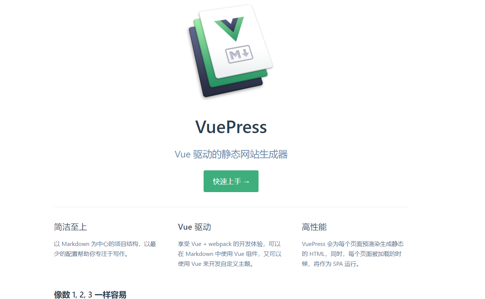
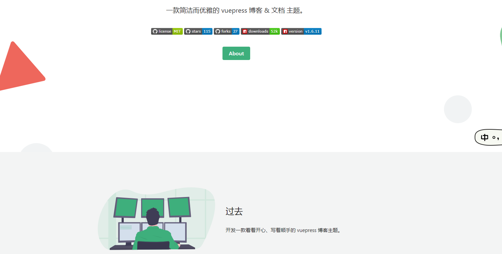

## 博客搭建
&nbsp;&nbsp;&nbsp;&nbsp;&nbsp;&nbsp;&nbsp;搭建一个这样的博客，其实非常简单，很多的功能代码，例如点击特效、主题背景什么的，都有现成的插件帮你实现，当然如果你想要开发一个自定义的主题，可能花费的时间可能更多一点。  
&nbsp;&nbsp;&nbsp;&nbsp;&nbsp;&nbsp;&nbsp;搭建这样一个博客，你需要有一定的js、vue、vuepress知识，搭建这样的博客，跟着视频一起搭建，即使是拖拖拉拉的状态，一天时间也绰绰有余，难的其实一直不是搭建，难的是内容的编写。  
&nbsp;&nbsp;&nbsp;&nbsp;&nbsp;&nbsp;&nbsp;如果你真的想为你的学生生涯留下点什么！就让我们从这里开始吧！  

## vuepress
&nbsp;&nbsp;&nbsp;&nbsp;&nbsp;&nbsp;&nbsp;博客是基于尤大大(尤雨溪)开发的一款免费开源的极简网站生成器[VuePress](https://v1.vuepress.vuejs.org/zh/)+ [vuepress-theme-reco](https://vuepress-reco-doc.vercel.app) 主题构建而成，如果你不知道 VuePress 是什么，这里有一些推荐bilibili视频，大家听完可能就会对其有一定的了解。  
&nbsp;&nbsp;&nbsp;&nbsp;&nbsp;&nbsp;&nbsp; [一步步搭建 VuePress 及优化](https://www.bilibili.com/video/BV1vb411m7NY?from=search&seid=12895446522739007147)  
&nbsp;&nbsp;&nbsp;&nbsp;&nbsp;&nbsp;&nbsp; [1小时带你搭建vuepress高大上个人博客（极速上手版）](https://www.bilibili.com/video/BV17t41177cr?from=search&seid=12895446522739007147)  
&nbsp;&nbsp;&nbsp;&nbsp;&nbsp;&nbsp;&nbsp;这里的视频仅是推荐，如果你有更好的视频资源，欢迎联系本人添加或分享。当然，如果遇到什么问题也可以私下联系我解决。

## VuePress-theme-reco
&nbsp;&nbsp;&nbsp;&nbsp;&nbsp;&nbsp;&nbsp;在视频中，我们看到的博客背景及样式基本都很固定，例如：  
  
&nbsp;&nbsp;&nbsp;&nbsp;&nbsp;&nbsp;&nbsp;但是大家可能也发现了，我的博客、[彭先生的博客](https://www.bookbook.cc/)好像都不是这样。例如：  
  
&nbsp;&nbsp;&nbsp;&nbsp;&nbsp;&nbsp;&nbsp;大家如果想要和我们相同的主题，可以了解下 [vuepress-theme-reco](https://vuepress-reco-doc.vercel.app) 主题，或者自行寻找其他风格的主题，亦或是自己开发一款主题。  
&nbsp;&nbsp;&nbsp;&nbsp;&nbsp;&nbsp;&nbsp;最后大家如果有需要、对文章的写作有修改意见、有希望博主添加的内容或者是一些希望实现的想法，都可以联系本人，希望我可以帮到你。  
  
  
  
|  QQ  | 微信 |
| ---- | ---- |
|||

