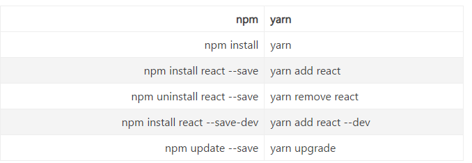

&nbsp;&nbsp;&nbsp;&nbsp;&nbsp;&nbsp;&nbsp;yarn和npm都是js包管理器，即管理引入的外部资源（node_modules），如果想了解两者的区别，请参考[npm和yarn的区别](https://www.jianshu.com/p/254794d5e741)。

### npm
&nbsp;&nbsp;&nbsp;&nbsp;&nbsp;&nbsp;&nbsp;查看当前镜像
```bash
  npm get registry
```
&nbsp;&nbsp;&nbsp;&nbsp;&nbsp;&nbsp;&nbsp;设置为淘宝镜像
```
  npm config set registry https://registry.npm.taobao.org/
```
&nbsp;&nbsp;&nbsp;&nbsp;&nbsp;&nbsp;&nbsp;设置为官方镜像
```
  npm config set registry https://registry.npmjs.org/
```
&nbsp;&nbsp;&nbsp;&nbsp;&nbsp;&nbsp;&nbsp;安装并设置 cnpm 的镜像
```
  npm install -g cnpm --registry=https://registry.npm.taobao.org
```
&nbsp;&nbsp;&nbsp;&nbsp;&nbsp;&nbsp;&nbsp;可能会因为下载速度或不希望更改npm的镜像地址等原因，我们无法从官方镜像上下载我们需要的包，这时就可以配置cnpm配置项来辅助管理包。  
&nbsp;&nbsp;&nbsp;&nbsp;&nbsp;&nbsp;&nbsp;在下载国内的包时使用cnpm，下载国外的包则采用npm，这样做的后果是，你需要参考观看别人的代码时需要使用分别使用npm和cnpm来下载包。

### yarn
&nbsp;&nbsp;&nbsp;&nbsp;&nbsp;&nbsp;&nbsp;查看当前镜像
```
  yarn config get registry
```
&nbsp;&nbsp;&nbsp;&nbsp;&nbsp;&nbsp;&nbsp;设置为淘宝镜像
```
  yarn config set registry https://registry.npm.taobao.org/
```
&nbsp;&nbsp;&nbsp;&nbsp;&nbsp;&nbsp;&nbsp;设置为官方镜像
```
  yarn config set registry https://registry.yarnpkg.com
```


&nbsp;&nbsp;&nbsp;&nbsp;&nbsp;&nbsp;&nbsp;感谢观看。

